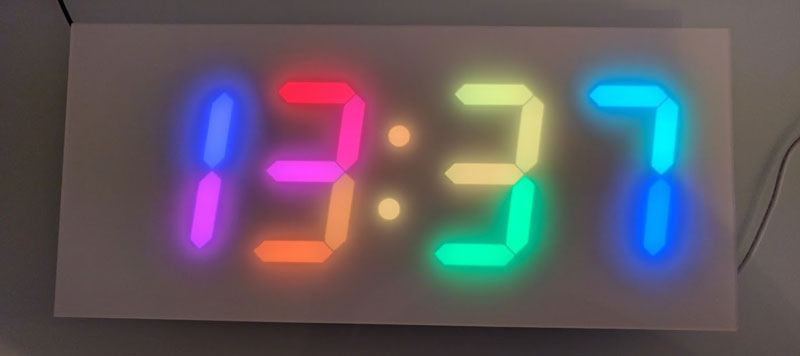
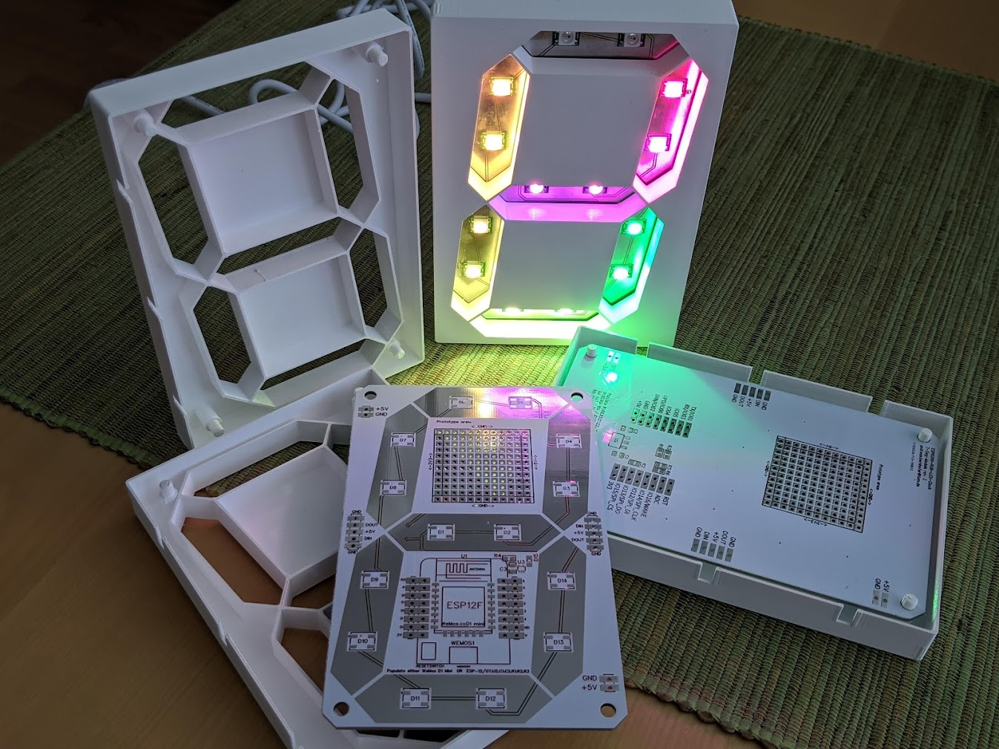
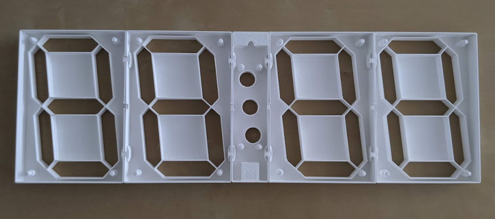
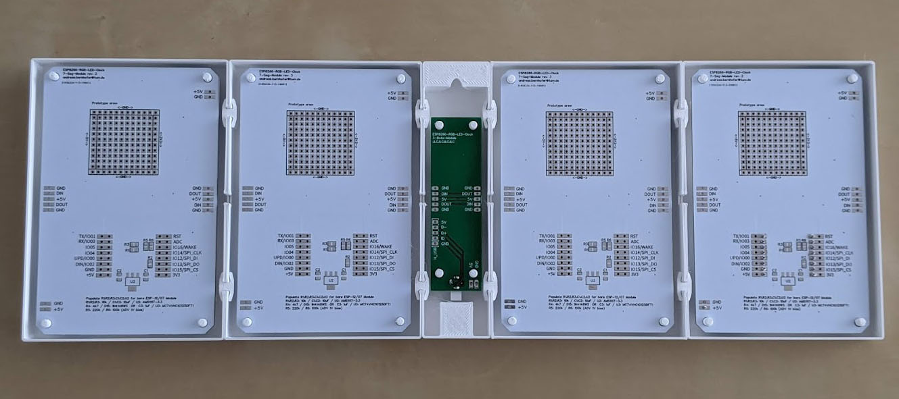
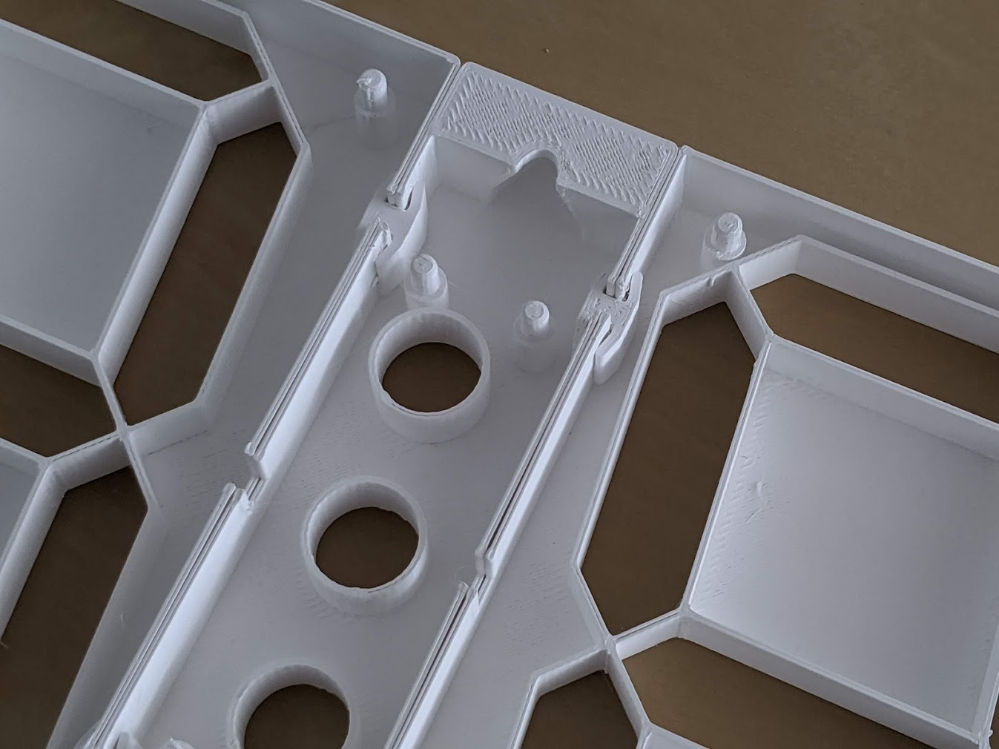
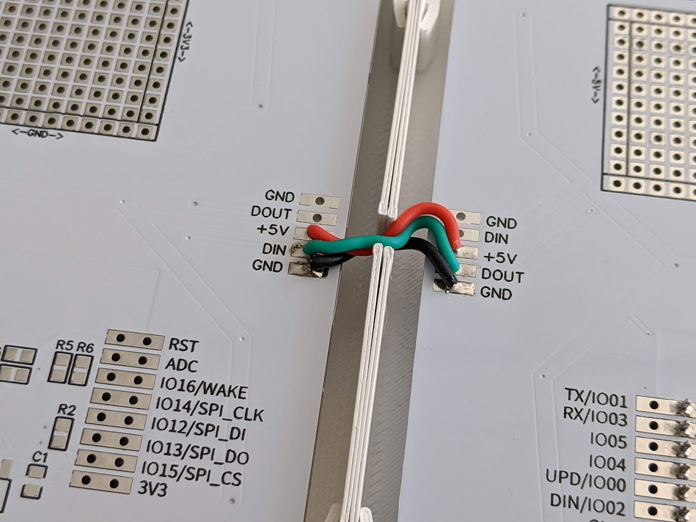

# ESP8266 based 7 segment RGB LED Clock

This project is a selfmade 450x200mm huge full color 7 segment RGB LED Clock, involving custom PCBs and 3D printing.

It's build using an ESP8266 (ESP-12/07 module or WeMos D1 Mini) and digitally controlled RGB LEDs like ES2812B/SK6812. The LEDs are placed on custom PCBs (one for each digit) that are sitting in a 3D printed housing. All digits are then stuck to the back of an acrylic sheet.

It also features a temperature and humidity sensor as well as a light sensor to automatically adjust the brightness.

It's running on 5V (MicroUSB or Barrel-Jack) and consumes about 1W (depending on brightness and color of course).

*Disclaimer: This is not really a full assembly guide. Don't expect much.*

# PCB and electronics BOM
- 59x 5050 RGB LED WS2812B/SK6812 (https://www.aliexpress.com/item/32814778563.html)
- With ESP8266 ESP12/07 Module:
  - ESP12/07 module
  - AMS1117-3.3
  - 3x 10k 0805
  - 2x 10uF 0805
  - 1x 220k 0805
  - 1x 100k 0805
- With WeMos D1 Mini:
  - WeMos D1 Mini V3 (https://www.aliexpress.com/item/32651747570.html)
- Temp/Humidity Sensor (choose one, optional)
  - BME280 I2C (https://www.aliexpress.com/item/1005003622447376.html)
  - DHT22 (https://www.aliexpress.com/item/1041496689.html)
- GL5528 LDR (https://www.aliexpress.com/item/1005003629058275.html)
- 22k 0805 (for LDR)
- 74AHCT1G125GW TTL Buffer (https://www.aliexpress.com/item/32871606717.html)
- 1uF 0805 (for TTL Buffer)
- DC-002 3.5 x 1.35mm Barrel Jack Socket (https://www.aliexpress.com/item/4000647661560.html)
- 5V/2A Power supply (https://www.amazon.de/dp/B00DS6UXLO/)

# Other Parts
- 3D Printed parts
- 450x200mm 2-4mm thick acrylic plexiglas
- white adhesive film (d-c-fix Design-Bastelklebefolie 45cm x 2m weiß seidenmatt 346-0001) (https://www.amazon.de/dp/B08M6518C7/)
- Silicone/Glue/Acryl cartridge (https://www.amazon.de/dp/B003YO87M2/)

# 3D Printing
## Material
The material needs to meet three basic criteria:
- **rigid** - otherwise the modules will flex and create gaps between the module and the plexiglas front
- **white** - to create an even lighting inside a segment
- **opaque** - so lit segments won't bleed light through to the neighboring segments

PLA is the best material choice for rigidity.

While white would be the obvious best color choice, I found that most white PLA is not opaque enough and light bleeds through to neighboring segments.
One solution is to use dark/black filament and paint it white afterwards (at least the inside facing walls of the segments).

Alternatively I had good results with special opaque white filament, like **kexcelled PETGk5 Basic Light Shielding White** (e.g. available here: https://ruhr3d.shop/products/petg-spezial-lichtdicht-1-75mm-natur-1-0kg ). However, since it is PETG, it tends to warp and flex more than PLA :/

I'm yet to find a perfect material to recommend 🤷‍♂️

## Other considerations
The print settings are not really important. Choose a thick layer height, like 0.3mm or more. It's really not important for the looks or functionality, but speeds up printing.

Dial in the extrusion with such that the external perimeters do not have gap fill, this otherwise slows down printing a lot. e.g. ~0.52mm work fine.

The most important feature of the print is the first perimeter of each segment. Make sure the perimeter lays down flat and closes perfectly, especially on the thin wall between segments.

When printed, try to cut/sand off any blobs that may prevent the PCB from sitting flush with the segments.

# Component pictures

The main component is the 7 segment display module, consisting of a custom PCB with LEDs populated (the ESP is only needed on the first one) and fit into it's 3D printed housing. These are then put together to form the Clock.

All the 3D prints are held together with simple clips and are later glued to the acrylic.

Wiring is pretty simple - there is only power and one data line looping through all segments

